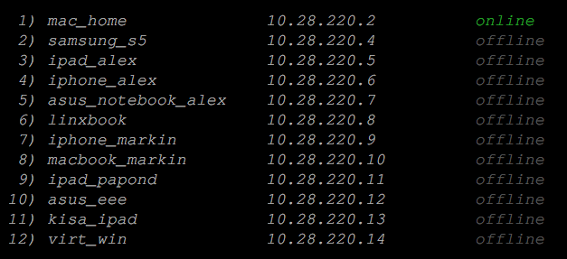

# OpenVPN server setup script
> Tested on Ubuntu 18.04 bionic, 17.10 artful, 16.04 xenial

This script is designed for quickly install the OpenVPN server with a working configuration that allows you to access the Internet with the substitution of your real location for the location of the server on which the OpenVPN is installed. Also, the script installs a simple utility for managing the OpenVPN server. You can learn about control commands after the installation script finishes running by typing "vpn" in the command line of your terminal.

For example:

instead `sudo systemctl restrt openvpn@<name_of_your_config>` you can type `vpn restart`

insted `sudo vi /etc/openvpn/<name_of_your_config>.conf` you can type `vpn config`

insted `sudo cat /var/log/openvpn/openvpn-status.log ` you can type `vpn users`,
and will see the list of users same as shown below

and some other management commands OpenVPN server will be much easier

> *I would be grateful for constructive criticism and suggestions for optimization*

> *Буду благодарен за конструктивную критику и предложения по оптимизации*
